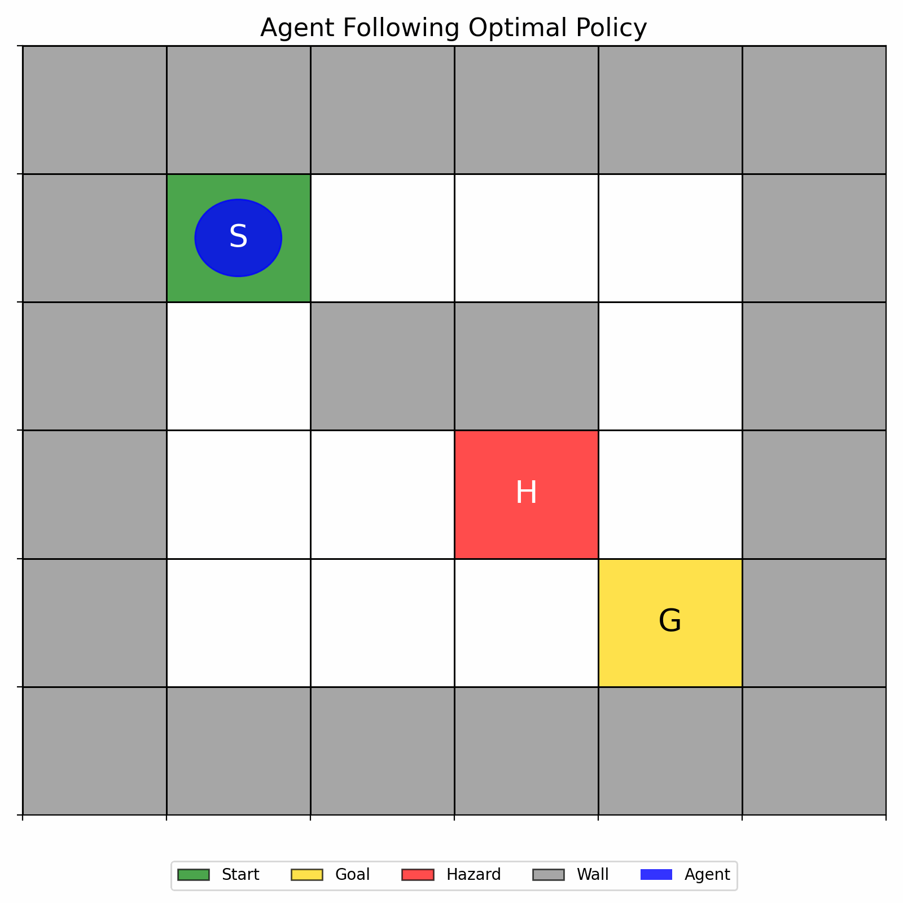
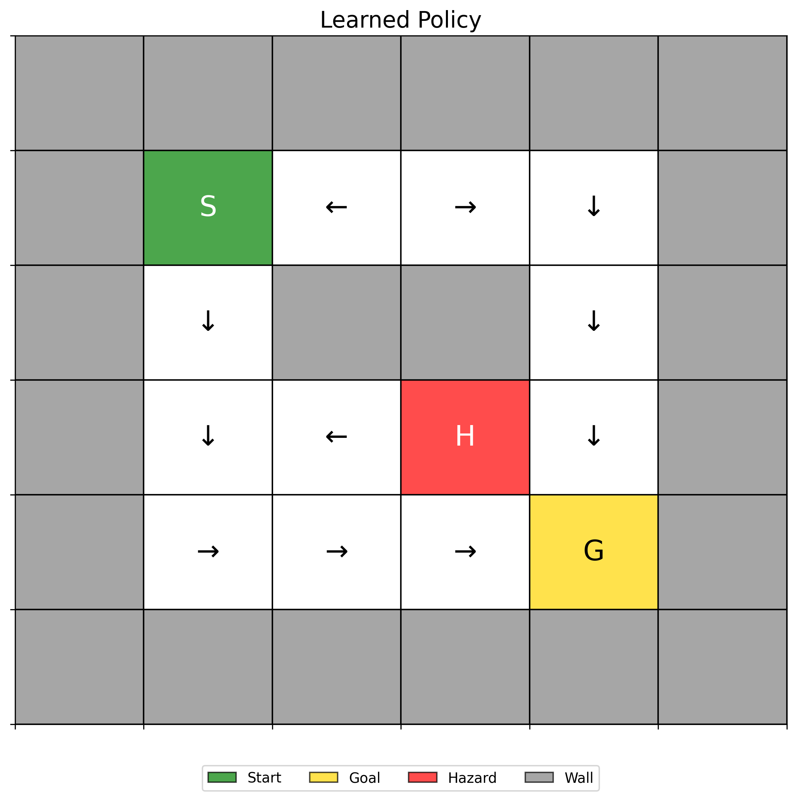
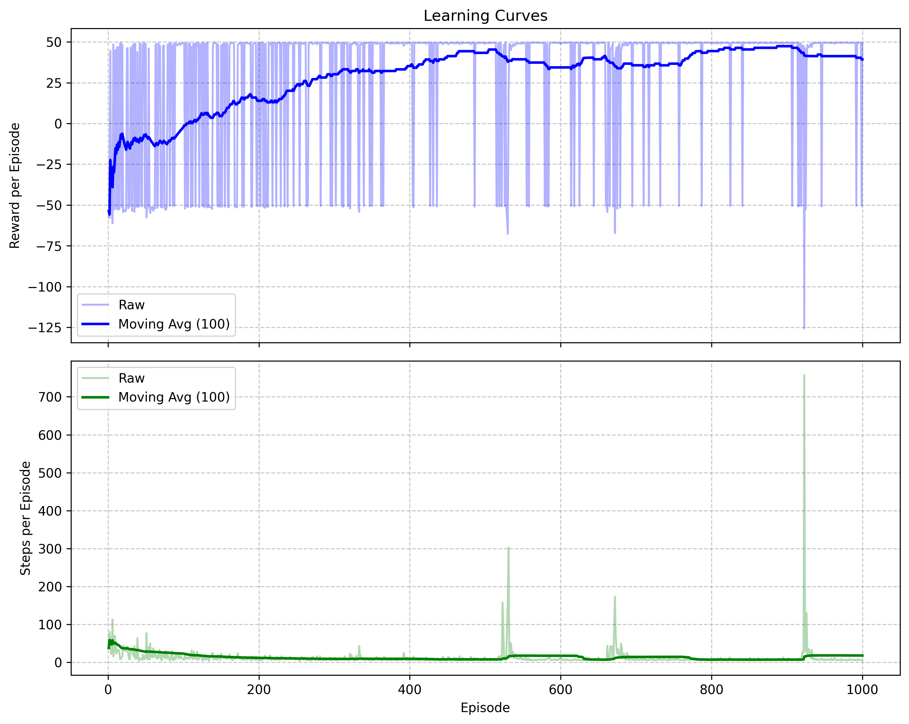
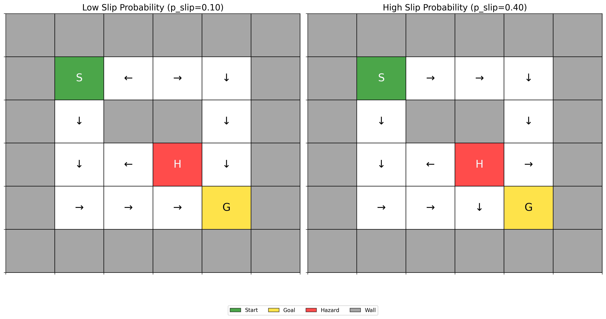
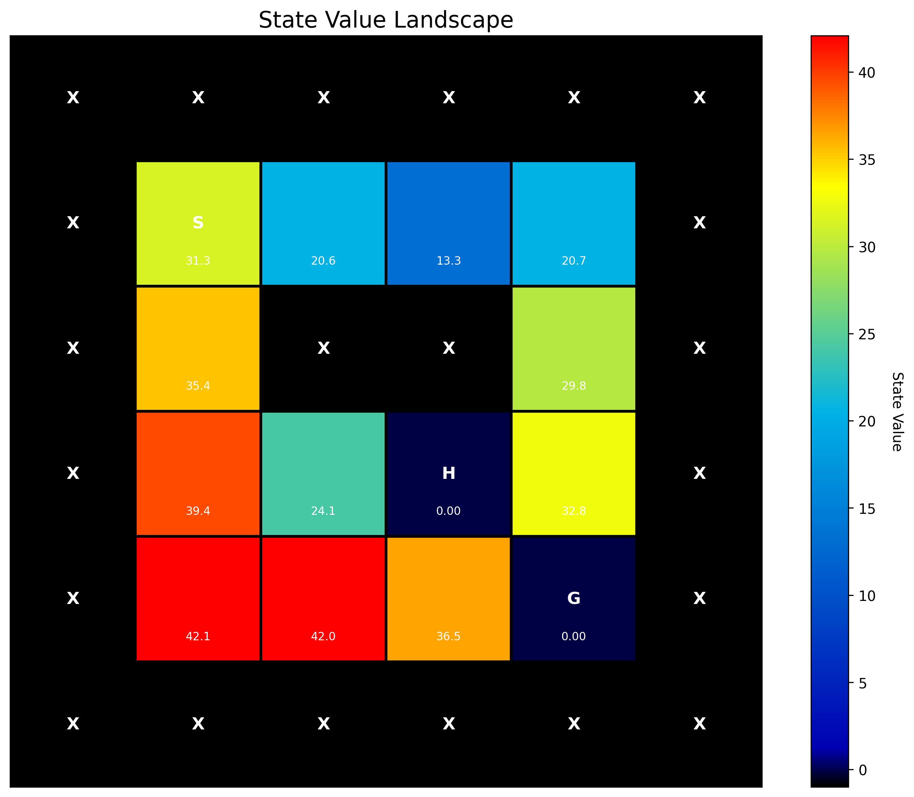
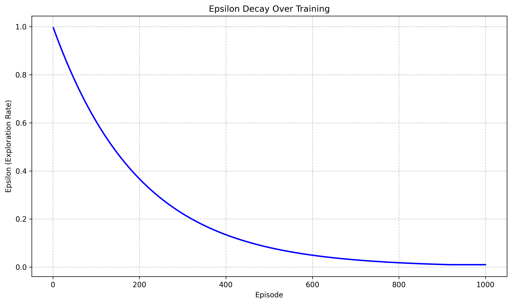

# Robust Agent Navigation in Stochastic Environments via Q-Learning

<div align="center">
  
</div>

## Project Overview

This project demonstrates the implementation of a Q-learning agent that learns to navigate optimally in a stochastic grid world environment. The agent must learn to deal with uncertainty in movement outcomes (a "slippery floor" effect) while finding the most efficient path to the goal and avoiding hazards.

### Key Technical Skills Demonstrated

- **Reinforcement Learning Algorithms** (Q-learning)
- **Stochastic Environment Modeling**
- **Policy Optimization**
- **Data Visualization & Analysis**
- **Python Programming with NumPy & Matplotlib**

## Environment & Problem

<div align="center">
  
</div>

- **Grid World**: A 6x6 grid with Start (S), Goal (G), Empty (.), Obstacle (X), and Hazard (H) cells
- **Stochastic Movement**: When the agent attempts to move in a direction:
  - With 80-90% probability: Moves in the intended direction
  - With 10-20% probability: Slips perpendicular to the intended direction
- **Rewards Structure**:
  - Reaching Goal: +50 (success)
  - Falling into Hazard: -50 (failure)
  - Moving to empty cell: -0.1 (small penalty to encourage efficiency)
  - Bumping into wall: -1 (larger penalty)

## Key Achievements

### 1. Learning Performance

<div align="center">
  
</div>

The agent demonstrates clear convergence of both reward and steps metrics over training episodes. As shown in the learning curves, the agent progressively:
- Increases its average reward per episode
- Decreases the number of steps needed to reach the goal
- Stabilizes in performance after sufficient exploration

### 2. Policy Adaptation to Uncertainty

<div align="center">
  
</div>

A key highlight is the agent's ability to adapt its policy to different levels of environmental uncertainty:
- **Low Uncertainty (10% slip)**: More direct routes are preferred
- **High Uncertainty (40% slip)**: More conservative paths away from hazards and walls are chosen
- The agent demonstrates robustness by learning appropriate risk-aversion based on uncertainty level

### 3. Value Function Learning

<div align="center">
  
</div>

The value heatmap demonstrates the agent's learned understanding of:
- Which states are most valuable (proximity to goal)
- Which states are dangerous (near hazards)
- How value propagates through the state space via the Bellman equation
- The impact of environmental uncertainty on state values

### 4. Exploration-Exploitation Balance

<div align="center">
  
</div>

The project implements an effective exploration strategy:
- Starting with high exploration (random actions)
- Gradually transitioning to exploitation of learned knowledge
- Maintaining minimum exploration to handle stochasticity

## Implementation Details

- **Environment**: Custom grid world with stochastic transition dynamics
- **Agent**: Q-learning with epsilon-greedy exploration
- **Hyperparameters**:
  - Learning rate (α): 0.1
  - Discount factor (γ): 0.95
  - Initial exploration rate (ε): 1.0
  - Epsilon decay: 0.995
- **Training**: 1000 episodes under different slip probabilities

## Results and Insights

- The agent successfully learns optimal policies even with high environmental stochasticity
- With higher slip probability (40%), the agent adopts more conservative routes to avoid potential hazards
- The epsilon-greedy strategy with decay provides an effective balance between exploration and exploitation
- Q-learning proves to be a robust algorithm for handling environmental uncertainty
- The visualizations clearly demonstrate both the learning process and the final optimal behaviors

## Running the Project

```bash
# Install required packages
pip install -r requirements.txt

# Run the simulation
python main.py
```

## Technical Requirements

- Python 3.6+
- NumPy
- Matplotlib

---

<div align="center">
  <i>This project demonstrates practical application of reinforcement learning concepts, MDP formulation, and the development of robust policies in stochastic environments.</i>
</div> 